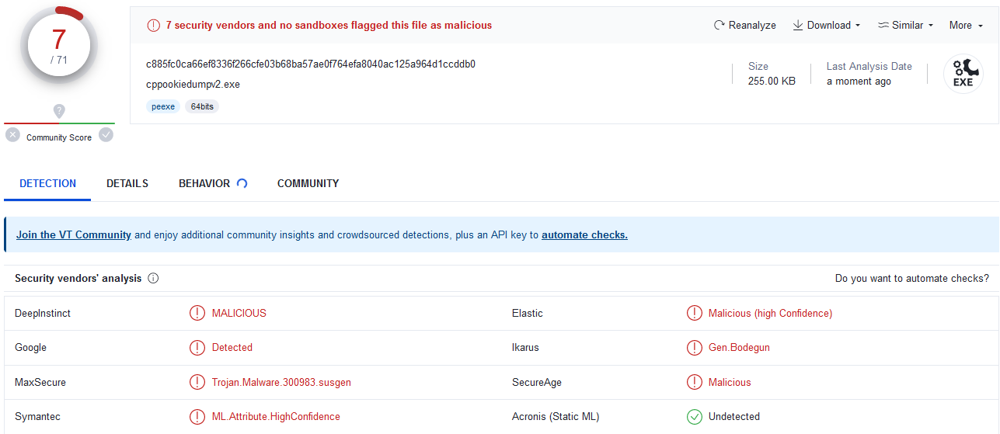

## README
- C++ implementation of [WhiteChocolateMacadamiaNut](https://github.com/slyd0g/WhiteChocolateMacademiaNut).
- Utilizes only winhttp (no 3rd party libraries) to interact with websockets and dump cookies from Google Chrome when launched with remote debugging enabled.

## Usage
`cppookiedumpv2.exe <port>`
